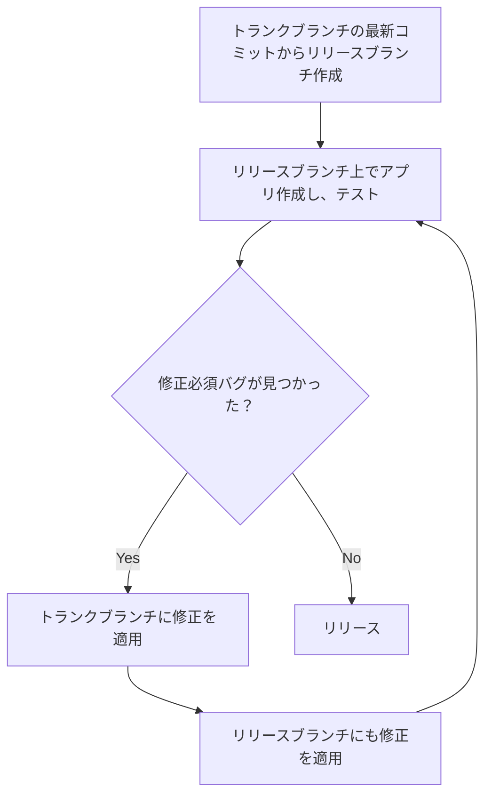
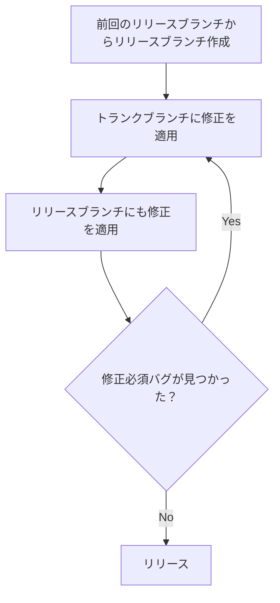

# はじめに

開発を進める中で Git のブランチ戦略を効果的に設計することは欠かせないものです。

今まで Git-flow を含むいくつかのブランチ管理を試してきました。

しかし、ブランチを多く活用すればするほど、開発者自身が気をつけて行うべき行動が増え、事故のリスクが高まります。
また、仕組みにより事故がなくなるようにする際にも、仕組みを作ること自体のコストがかかります。

そうしたブランチ戦略疲れを感じつつ、**できるだけシンプルで効果的なブランチ戦略を模索していく中で、トランクベース開発にたどり着きました**。

https://dora.dev/devops-capabilities/technical/trunk-based-development/

トランクベース開発は、複雑なブランチ戦略を全く取らず、トランクブランチというメインのブランチ 1 つに対してのみエンジニア全員が修正していく開発手法です。

トランクベース開発はシンプルな戦略ですが、Git-flow などと比較した従来の戦略とは大きく異なります。
そのため**実際のプロジェクトで導入する際は、機能追加の計画や、開発粒度、テスト方法、リリース計画などさまざまな業務フローを見直して調整する必要が生じます**。

こうした中で、元々の目的を見失わないように業務フローを整理するためには、**トランクベース開発で解決したい開発上の課題をよく理解することが重要**です。

本記事では、私が解釈している「トランクベース開発で解決したいこと」と、現状私が取り組んでいるプロジェクトで実践している「トランクベース開発のやり方」について書いてみます。

# 本記事で書くこと・書かないこと

本記事では、以下の内容を書いていきます。

- 私が解釈している、トランクベース開発で解決したい開発上の課題
- 私が取り組んでいるプロジェクトにおける、トランクベース開発の戦略
  - 特にリリースフロー

一方で、以下の内容については書かないこととします。

- トランクベース開発の概要やメリット・デメリット
- トランクベース開発における具体的なツールやプラクティス

# 私のトランクベース開発の解釈

## トランクベース開発で解決したい開発上の課題

一般的によく使われる Git のブランチ機能を多用する開発戦略では、以下のような状態が発生しやすいです。

- 大規模または長期にわたるコード修正を特定のエンジニアだけで閉じて行う
- 修正したコードを一時的にマージしない期間を設ける

これらは、**安全な開発を脅かしたり開発スピードを下げたりする要素となる**ため、トランクベース開発ではこれらを禁止した上で開発フローを再構築します。

### 課題 1: 大規模または長期にわたるコード修正を特定のエンジニアだけで閉じて行う

大規模または長期にわたるコード修正は**認知の負荷やマージの難易度が上がり、それに伴うリスクが高まります**。

- 実装者自身の動作確認が十分に行えないことが多い
- コードレビューが十分に行えないことが多い
- マージ時にコンフリクトが発生し、コンフリクト解消ミスを起こしやすい
- バグ発生時の原因特定が難しい
- 特定のエンジニアだけの知見しか反映されず、他のエンジニアの知見が活かされにくい

以下のような**リリースブランチを作り最後にトランクブランチへマージするという営み**も同様のリスクがあります。

- 開発ブランチからリリースブランチを分岐させ、受け入れ試験で発生したバグ修正をそこに適用し、最後に開発ブランチへマージする
  - このような戦略は、開発ブランチを触っているエンジニアとリリースブランチを触っているエンジニアが異なるため、コンフリクトが発生しやすい

Git-flow などの一般的なブランチ戦略では、よくみられるものです。

### 課題 2: 修正したコードを一時的にマージしない期間を設ける

開発者の手元でコード修正が滞留し、コードレビューやデプロイ、テストなど**各種の開発プロセスが停滞してしまいます**。

一時的にマージしない状況としては、以下のケースが一般的によくあります。

- リリースのためのテストなどを行っている際に、機能開発やリファクタリングなどのコード修正がリリースされるコードに混ざることを防ぐために、一時的にマージをしないようにする

# トランクベース開発の実践方法

## 全体像

小さな修正を頻繁に行い全員が見えるところに公開していきます。
また、リリースブランチはリリースのためだけの使い捨てのものとし、トランクブランチにはマージしないようにします。

以下、普段の開発とリリースフロー（定期リリースと hotfix リリース）に焦点を当てて解説していきます。

## 普段の開発

エンジニアは、**機能開発やバグ修正などのバックログにおけるチケット種別や、ターゲットのリリースバージョンに関わらず、全ての修正をトランクブランチにマージ**します。

PR マージ時に Squash マージを採用しているため、最終的には **PR が 1 つマージされるとトランクブランチに 1 つコミットが生成される**ことになります。

## 定期リリース

定期リリースの際には以下のようなフローをたどります。

1. 基本的にはトランクブランチの最新コミットからリリースブランチを分岐させ、初回ビルドする。
2. ビルドされたアプリに対しテストを行う。
3. リリースまでに修正必須の重大度のバグが見つかれば、バグ修正をトランクブランチに適用し、リリースブランチにも適用する。
4. リリースブランチで追加ビルドを行い、再テストする。
5. 2-4 を修正必須のバグがなくなるまで繰り返し、最後のビルドをリリースする。

リリースした後、**リリースブランチはトランクブランチにはマージしません**。

以下、詳細に解説していきます。

### 初回ビルド

基本的には**トランクブランチの最新コミットからリリースブランチを分岐**させます。
分岐させたブランチ上で初回ビルドを行います。

例外としては、以下のような理由により**次のリリースに含みたくない修正がトランクブランチ上に適用されている**場合、それを含まない形でリリースブランチを切ることがあります。

- リリース時のシステム全体へ与えるリスクが高く、その対策ができていない
- デグレを引き起こすことが明確に分かっている
- 後のリリースで提供したい機能である

:::message
基本的には上記のように特定のコミットだけリリースに含めないということは、後述するようにリリース戦略が複雑になるため避けるべきです。
これを避けるための手段として、開発の計画段階でシステム全体へのリスクやリリース単位を検討しておき、必要に応じてフィーチャートグル（リリーストグルや Ops トグル）を導入する方法があります。
:::

要約すると、最初のビルドでは、いくつかの例外を除いて、トランク ブランチ上のすべてのコミットが収集されます。
そのため、**包括的なかき集めフェーズ**と捉えることができます。

### 2 回目以降のビルド

ビルドされたアプリでテストを行い、バグが見つかった場合には**トランクブランチに修正を適用**します。

その後、トランクブランチ上の修正を**リリースブランチにチェリーピックにより適用**します。

:::message
チェリーピックとは、修正内容を別のブランチに対して再適用する作業です。通常は Git の機能により機械的に行えます。
:::

つまり、**リリースブランチ上でテストしている一方で、バグが見つかった場合にはエンジニアはまずトランクブランチで調査と修正をしています**。

テストするブランチとテストで見つかったバグを調査・修正するブランチが一致していないのは一見奇妙に思われます。
しかしこの戦略は、以下の考えに基づいています。

- **リリースブランチとトランクブランチは大きく乖離していない前提**なので、バグの再現性やバグ修正のベースとなるコードとして同一視して実用上問題ない
- リリースブランチを担当するエンジニア以外は複雑なブランチ管理をすることなく、バグ修正の内容だけに集中してほしい

トランクブランチとリリースブランチの乖離が大きいと上記の戦略は破綻するため、以下の図に示すような乖離部分が大きくならないよう開発フローや品質を最適化していく必要があります。

:::message
バグ修正を適用した時点のトランクブランチのコミットで 2 回目以降のビルドを行うという選択肢もあります。
しかし、この方法ではトランクブランチにリリースのバグ対応以外の修正が含まれてしまう可能性があり、追加でテストすべき範囲が広がってしまうため採用していません。
:::

要約すると、2 回目以降のビルドではトランクブランチ上のコミットの一部のみが収集されます。
そのため、**排他的なかき集めフェーズ**と捉えることができます。

## hotfix リリース

hotfix リリースの際には以下のようなフローをたどります。

1. 前回のリリースブランチからリリースブランチ作成する。
2. バグ修正をトランクブランチに適用し、リリースブランチにも適用する。
3. リリースブランチでビルドを行い、テストする。
4. 2-3 を修正必須のバグがなくなるまで繰り返し、最後のビルドをリリースする。

定期リリースと同様に、リリースした後**リリースブランチはトランクブランチにはマージしません**。

ブランチの図で示すと以下のようになります。

定期リリースの 2 回目以降のビルドと同様に、**排他的なかき集め**フェーズと捉えることができます。

## 次の定期リリースのビルドを開始する

リリースが完了し、次の定期リリースのビルドを開始したい場合は、**再度トランクブランチの最新コミットからリリースブランチを作成**します。

前回のリリースブランチ(v1.0 リリースブランチ)は、利用しません。

# 最後に

トランクベース開発は、シンプルな戦略です。
しかし、リリースの開発フローをプロジェクトに応じた形で最適化する必要があります。

今後も、トランクベース開発を実践しながら、より効果的な開発フローを模索していきたいと考えています。
