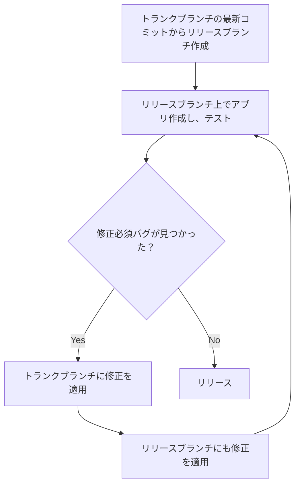
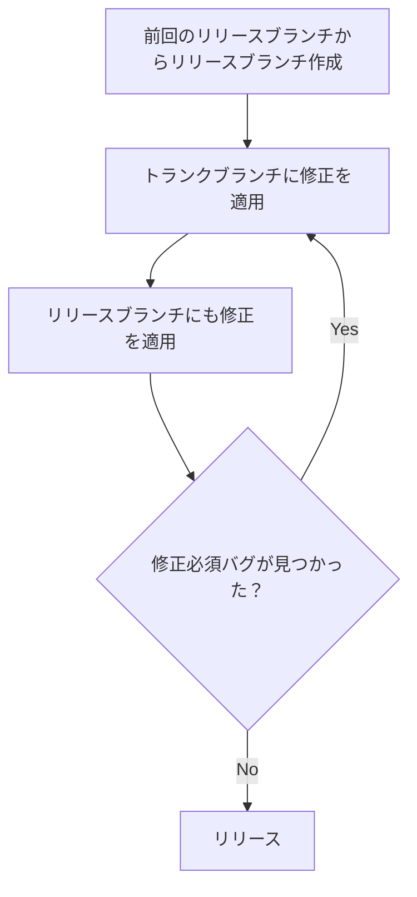

こんにちは、モバイルエンジニアのころむにーです。

普段、モバイルアプリを通じたユーザーへの価値提供を目指すプロジェクトに、技術リードという立場で参加しています。

本記事では、開発プロセスの設計におけるブランチ戦略について、私個人が最近考えていることをまとめてみます。

# はじめに

開発を進める中で Git のブランチ戦略を効果的に設計することは欠かせないものです。

今まで Git-flow を含むいくつかのブランチ管理を試してきました。

しかし、ブランチを多く活用すればするほど、エンジニア自身が気をつけて行うべき行動が増え、事故のリスクが高まります。
また、事故を防ぐ仕組みを導入する際にも、仕組みを作ること自体のコストがかかります。

そうしたブランチ戦略の試行錯誤に疲れを感じながら**できるだけシンプルで効果的なブランチ戦略を模索していく中で、トランクベース開発にたどり着きました**。

https://dora.dev/devops-capabilities/technical/trunk-based-development/

トランクベース開発は、複雑なブランチ戦略を全く取らず、トランクブランチというメインのブランチ 1 つに対してのみエンジニア全員が修正していく開発手法です。

トランクベース開発はシンプルな戦略ですが、Git-flow などと比較した従来の戦略とは大きく異なります。
そのため、**実際のプロジェクトで導入する際は、機能追加の計画や、開発粒度、テスト方法、リリース計画などさまざまな業務フローを見直して調整する必要が生じます**。

こうした中で、元々の目的を見失わないように業務フローを整理するためには、**トランクベース開発で解決したい問題をよく理解しておくことが重要**です。

本記事では、私が解釈している「トランクベース開発で解決したいこと」と、現状私が取り組んでいるプロジェクトで実践している「トランクベース開発のブランチ戦略」について書いてみます。

# 本記事で書くこと・書かないこと

本記事では、以下の内容を書いていきます。

- 私が解釈している、トランクベース開発で解決したい問題
- 私が取り組んでいるプロジェクトにおける、トランクベース開発のブランチ戦略
  - 特にリリース周り

一方で、以下の内容については書かないこととします。

- トランクベース開発の概要やメリット・デメリット
- トランクベース開発における具体的なツールやプラクティス

トランクベース開発のメリット・デメリットに関しては、別の記事で書いています。
気になる方は、こちらも参考にしてみてください。

https://zenn.dev/sun_asterisk/articles/trunk-based-development-pros-and-cons

# トランクベース開発で解決したい問題

一般的によく使われる Git のブランチ機能を多用する開発戦略では、以下のような状況が発生しやすいです。

- 大規模または長期にわたるコード修正を特定のエンジニアだけで閉じて行う
- 修正したコードを一時的にマージしない期間を設ける

これらは、**安全な開発を脅し、開発スピードを下げる要素となる**ため、トランクベース開発ではこれらを禁止した上で開発フローを再構築します。

以下でそれぞれの状況における問題点を解説します。

## 1. 大規模または長期にわたるコード修正を特定のエンジニアだけで閉じて行う

大規模または長期にわたるコード修正は、**認知負荷やマージの難易度が上がり、それに伴い以下のようなリスクが高まります**。

- 実装者自身の動作確認が十分に行えないことが多い
- コードレビューが十分に行えないことが多い
- マージ時にコンフリクトが発生し、コンフリクトの解消ミスを起こしやすい
- バグ発生時の原因特定が難しい
- 特定のエンジニアだけの知見しか反映されず、他のエンジニアの知見が活かされにくい

以下の図のように、実際にマージするタイミング周辺で問題が顕在化します。

また、以下のような**リリースブランチを作り最後にトランクブランチへマージするという営み**も同様のリスクがあります。

- 開発ブランチからリリースブランチを分岐させ、受け入れ試験で発生したバグ修正をそこに適用し、最後に開発ブランチへマージする

この状況では、開発ブランチとリリースブランチでそれぞれ長期間のコード修正が発生しているため、前述のものと同様の問題が発生します。

Git-flow などの一般的なブランチ戦略ではよくみられるものです。

## 2. 修正したコードを一時的にマージしない期間を設ける

エンジニアの手元でコード修正が滞留し、コードレビューやデプロイ、テストなど**各種の開発プロセスが停滞してしまいます**。

一時的にマージしない状況は、以下ようなケースでよく発生します。

- リリースのためのテストなどを行っている際に、機能開発やリファクタリングなどのコード修正がリリースされるコードに混ざることを防ぐために、一時的にマージをしないようにする

# トランクベース開発のブランチ戦略

現状私が取り組んでいるプロジェクトで実践している「トランクベース開発のブランチ戦略」について書いていきます。

## 概要

通常開発時、**エンジニア全員が小さな修正を頻繁にトランクブランチに適用**していきます。

リリース時、基本的にトランクブランチの最新コミットからリリースブランチを分岐させ、リリースのためのテストを開始します。
リリースのためのテスト中、**通常開発とテストで見つかったバグの修正は並行して進め、両方ともトランクブランチに適用**します。

リリースのテストにおけるバグ修正は、リリースブランチにも適用します。
この際、**トランクブランチ上の通常開発のコミットが含まれないよう、チェリーピックを利用**します。

**リリースブランチはリリースのためだけの使い捨て**のものとし、トランクブランチにはマージしません。

以下、普段の開発とリリースフロー（定期リリースと hotfix リリース）に焦点を当てて解説していきます。

## 普段の開発

エンジニアは、**機能開発やバグ修正などのバックログにおけるチケット種別や、ターゲットのリリースバージョンに関わらず、全ての修正をトランクブランチにマージ**します。

PR マージ時に Squash マージを採用しているため、最終的には **PR が 1 つマージされるとトランクブランチに 1 つコミットが生成される**ことになります。

## 定期リリース

定期リリースの際には以下のようなフローをたどります。

1. 基本的にはトランクブランチの最新コミットからリリースブランチを分岐させ、初回ビルドする。
2. ビルドされたアプリに対しテストを行う。
3. リリースまでに修正必須の重大度のバグが見つかった場合、バグ修正をトランクブランチに適用し、リリースブランチにも適用する。
4. リリースブランチで追加ビルドを行い、再テストする。
5. 3-4 を修正必須のバグがなくなるまで繰り返し、最後のビルドをリリースする。

リリースした後、**リリースブランチはトランクブランチにはマージしません**。

以下、詳細に解説していきます。

### 初回ビルド

基本的には**トランクブランチの最新コミットからリリースブランチを分岐**させます。
分岐させたブランチ上で初回ビルドを行います。

場合によっては、以下のような理由により**次のリリースに含めたくない修正がトランクブランチ上に適用されている**ことがあります。

- テストが十分にできていない
- 将来のリリースで提供したい機能が先に一般ユーザーへ公開されてしまう

この場合は、チェリーピックを利用してそれらの修正を除外する形でリリースブランチを構築します。

:::message
チェリーピックとは、修正内容を別のブランチに対して再適用する作業です。通常は Git の機能により機械的に行えます。
:::

基本的に、特定のコミットだけリリースから除外するのは、ブランチ構築が複雑になるため避けるべきです。

:::message
特定のコミットだけリリースから除外することを避けるために、以下のような手段が取れます。

- マージからテスト完了までのリードタイムを短くし、テストが十分にできていないコミットが頻発しないようにする
- フィーチャートグルを導入し、修正がリリースされたとしても一般ユーザーへの公開を別手段で制御できるようにする

:::

要約すると、最初のビルドでは、いくつかの例外を除いて、トランクブランチ上のすべてのコミットが収集されます。
そのため、**トランクブランチから包括的にコミットを集めてビルドしている**と捉えることができます。

### 2 回目以降のビルド

リリースのためのテストを行い、バグが見つかった場合にはまず**トランクブランチに修正を適用**します。

前提として、**リリースのためのテスト中にも通常の開発は継続される**ため、トランクブランチには機能追加やバグ対応のコード修正も混在していきます。
その状況を踏まえると、リリースブランチにはリリースのためのテストに対するバグ修正のみを含めたいです。

そのため、リリースブランチには**リリースのためのテストに対するバグ修正だけをチェリーピックにより適用**します。

要約すると、2 回目以降のビルドではトランクブランチ上のコミットの必要なもののみが収集されます。
そのため、**トランクブランチから排他的にコミットを集めてビルドしている**と捉えることができます。

#### 補足

上記の戦略では、**リリースブランチ上でテストしている一方で、バグが見つかった場合にはエンジニアはまずトランクブランチで調査と修正をする**ことになります。

テストするブランチとテストで見つかったバグを調査・修正するブランチが一致していないのは一見奇妙に思われます。
しかしこの戦略は、以下の考えに基づいています。

- **リリースブランチとトランクブランチは大きく乖離していない前提**なので、バグの再現性やバグ修正のベースとなるコードとして同一視して実用上問題ない
- リリースブランチを担当するエンジニア以外は複雑なブランチ管理をすることなく、バグ修正の内容だけに集中したい

トランクブランチとリリースブランチの乖離が大きいと上記の戦略は破綻するため、以下の図に示すような乖離部分が大きくならないよう開発フローや品質を最適化していく必要があります。

:::message
バグ修正を適用した時点のトランクブランチのコミットで 2 回目以降のビルドを行うという選択肢もあります。
しかし、この方法ではトランクブランチにリリースのバグ対応以外の修正が含まれてしまい、追加でテストすべき範囲が広がってしまうため採用していません。
:::

## hotfix リリース

hotfix リリースの際には以下のようなフローをたどります。

1. 前回のリリースブランチから新しくリリースブランチ作成する。
2. バグ修正をトランクブランチに適用し、リリースブランチにも適用する。
3. リリースブランチでビルドを行い、テストする。
4. 2-3 を修正必須のバグがなくなるまで繰り返し、最後のビルドをリリースする。

定期リリースと同様に、リリースした後**リリースブランチはトランクブランチにはマージしません**。

hotfix リリースの初回ビルドは図で示すと以下のようになります。

これは**定期リリースの 2 回目以降のビルドとほぼ同等の内容**で、「リリースのためのテストに対するバグ修正」となっていた箇所が「hotfix として含めたい修正」となっているだけです。

もし 修正必須のバグが見つかり 2 回目以降のビルドを行う場合は、定期リリースの 2 回目以降と同様の戦略を取ります。

## 次の定期リリースのビルドを開始する

リリースが完了し、次の定期リリースのビルドを開始したい場合は、**再度トランクブランチの最新コミットからリリースブランチを作成**します。

前回のリリースブランチ(v1.0 リリースブランチ)は、利用しません。

# 最後に

トランクベース開発は、考え方は非常にシンプルな戦略です。
しかし、細かい開発フローはプロジェクトに応じた形で最適化する必要があります。

今後も、トランクベース開発を実践しながら、より効果的な開発フローを模索していきたいと考えています。
